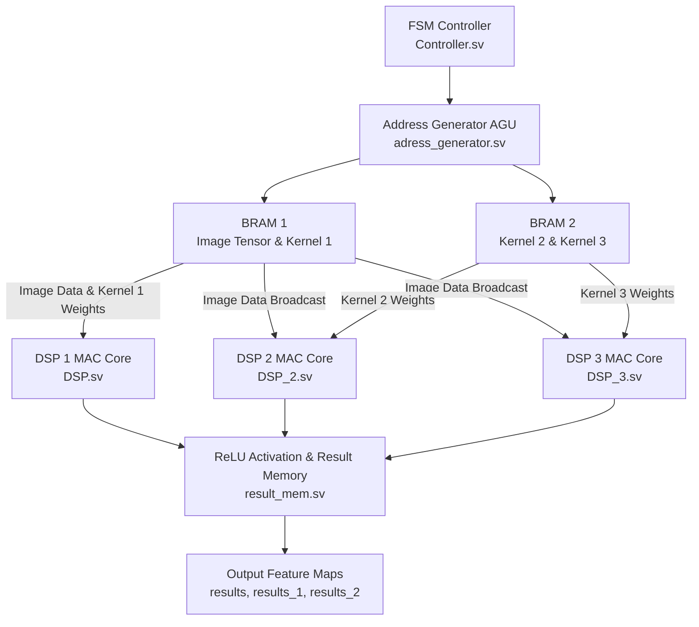

# CNN Accelerator Architecture (FPGA SystemVerilog)

A hardware-accelerated 3D Convolutional Neural Network (CNN) Engine implemented in SystemVerilog for Xilinx FPGA deployment. This project implements a fully parameterized, multi-channel 3D convolution layer processor featuring 3 parallel DSP MAC compute engines, dynamic kernel parameterization, 3D memory address generation, and integrated ReLU activation.

---

## Project Overview

Convolutional Neural Networks (CNNs) rely heavily on multi-channel matrix convolutions, which are computationally dominated by Multiply-Accumulate (MAC) operations. Standard general-purpose processors (CPUs/GPUs) introduce memory bandwidth bottlenecks when streaming high-dimensional feature map tensors.

This project implements a custom FPGA hardware accelerator datapath designed to optimize compute throughput, minimize memory access latency, and maximize resource utilization on Xilinx FPGAs via Vivado synthesis and behavioral simulation.

---

## Hardware Architecture and Datapath

The accelerator architecture consists of five primary hardware blocks:

1. **Address Generation Unit (AGU)** (`adress_generator.sv`): Maps 3D spatial coordinates `(channel, row, column)` into sequential 1D Block RAM memory addresses.
2. **Execution Controller (FSM)** (`Controller.sv`): A finite state machine (`IDLE`, `RUN`, `DONE`) managing 2D spatial patch windowing, depth channel iterations, read enables, accumulator clears, and result write strobes.
3. **Dual-Port Block RAM Units** (`BRAM_1.sv`, `BRAM_2.sv`): Dual-port memory structures storing 3D image pixel tensors (`BRAM.mem`) and weight matrices (`Kernel_1.mem`, `kernel_2.mem`, `Kernel_3.mem`).
4. **Multi-DSP Compute Engines** (`DSP.sv`, `DSP_2.sv`, `DSP_3.sv`): Three parallel Multiply-Accumulate (MAC) cores with 27-bit accumulator registers that process three output feature map kernels concurrently.
5. **ReLU Activation & Result Memory** (`result_mem.sv`): Latching unit that applies independent rectified linear unit activation per DSP channel upon completion of depth channel accumulation.

### Architectural Datapath Flowchart



---

## Mathematical Formulation

### 1. Multi-Channel 3D Convolution Equation

For an input tensor $X$ with $D$ input channels and spatial resolution $H \times W$, the output pixel $Y$ for filter $c_{out}$ at spatial location $(r, c)$ with kernel size $K$ is defined as:

$$
Y_{c_{out}}(r, c) = \max \left( 0, \sum_{c_{in}=0}^{D-1} \sum_{i=0}^{K-1} X(c_{in}, r, c, i) \cdot W_{c_{out}}(c_{in}, i) \right)
$$

### Plain-Text Representation:

```text
Y[c_out][r][c] = max( 0, Sum over c_in from 0 to D-1 of ( Sum over i from 0 to K-1 of ( X[c_in][r][c][i] * W[c_out][c_in][i] ) ) )
```

Where:
- `X(c_in, r, c, i)` is the pixel value at spatial window element offset `i` in channel `c_in`.
- `W(c_out, c_in, i)` is the weight value for output filter `c_out` at channel `c_in` offset `i`.
- `K` is the total number of elements per kernel patch (e.g., $K=9$ for a $3 \times 3$ kernel).
- $\max(0, z)$ is the non-linear Rectified Linear Unit (ReLU) activation function.

---

## Key Hardware Features

- **Multi-DSP Parallel Processing**: Processes 3 output kernels simultaneously in parallel using dedicated DSP MAC modules (`DSP.sv`, `DSP_2.sv`, `DSP_3.sv`).
- **Dynamic Parameterization**: Configurable `kernel_size`, `depth_val`, `mem_length`, `accum_length`, and `depth_width` parameters across top-level and submodules.
- **3D Depth Accumulation**: Multi-channel accumulation without clearing between channels; accumulator reset triggers only upon spatial window transition.
- **Rectified Linear Unit (ReLU)**: Integrated non-linear activation applied per channel before storing results into output memory buffers.

---

## Repository Directory Structure

```text
CNN-accelerator/
├── MAC.srcs/
│   ├── sources_1/new/
│   │   ├── adress_generator.sv   # 3D spatial to 1D linear memory AGU
│   │   ├── Controller.sv          # Main execution FSM controller
│   │   ├── BRAM_1.sv              # Dual-port BRAM for image & Kernel 1
│   │   ├── BRAM_2.sv              # Dual-port BRAM for Kernel 2 & Kernel 3
│   │   ├── DSP.sv                 # Multiply-Accumulate (MAC) DSP core 1
│   │   ├── DSP_2.sv               # Multiply-Accumulate (MAC) DSP core 2
│   │   ├── DSP_3.sv               # Multiply-Accumulate (MAC) DSP core 3
│   │   ├── result_mem.sv          # ReLU activation and feature map storage
│   │   └── CNN_TOP_module.sv      # Top-level accelerator integration wrapper
│   └── sim_1/new/
│       └── TB_CC_full.sv          # System-level testbench environment
├── BRAM.mem                       # Image tensor memory initialization file
├── Kernel_1.mem                   # Multi-channel weights for Kernel 1
├── kernel_2.mem                   # Multi-channel weights for Kernel 2
├── Kernel_3.mem                   # Multi-channel weights for Kernel 3
├── MAC.xpr                        # Xilinx Vivado project file
└── README.md                      # Project architecture documentation
```

---

## Simulation and Verification

The top-level testbench (`TB_CC_full.sv`) validates multi-channel, multi-DSP 3D convolution on a 5 x 5 x 2 input tensor (`H=5, W=5, D=2`) with 3 x 3 kernels across all 3 parallel DSP channels.

### Verified Simulation Results (`depth = 2`):

```text
CONVOLUTION COMPLETE - MULTI-DSP RESULTS
======================================
Result_DSP1[0] = 0  |  Result_DSP2[0] = 7  |  Result_DSP3[0] = 47
Result_DSP1[1] = 0  |  Result_DSP2[1] = 6  |  Result_DSP3[1] = 54
Result_DSP1[2] = 0  |  Result_DSP2[2] = 7  |  Result_DSP3[2] = 63
Result_DSP1[3] = 0  |  Result_DSP2[3] = 10 |  Result_DSP3[3] = 90
Result_DSP1[4] = 0  |  Result_DSP2[4] = 13 |  Result_DSP3[4] = 101
Result_DSP1[5] = 0  |  Result_DSP2[5] = 12 |  Result_DSP3[5] = 112
Result_DSP1[6] = 0  |  Result_DSP2[6] = 17 |  Result_DSP3[6] = 141
Result_DSP1[7] = 0  |  Result_DSP2[7] = 16 |  Result_DSP3[7] = 152
Result_DSP1[8] = 0  |  Result_DSP2[8] = 19 |  Result_DSP3[8] = 163
======================================
```

---

## How to Run Simulation in Xilinx Vivado

1. Open **Vivado** (2019.1 or later).
2. Open project file `MAC.xpr`.
3. Set `CNN_TOP_tb` (`TB_CC_full.sv`) as the active simulation top module.
4. Click **Run Simulation -> Run Behavioral Simulation**.
5. Set simulation run time to `2us` (`run 2us` in TCL console).
6. Observe TCL Console outputs verifying 100% exact mathematical results across all 3 feature maps.

---

## Author & License
- **Author**: Mohammad Usman Irshad
- **Repository**: `CNN-accelerator`
- **License**: MIT
